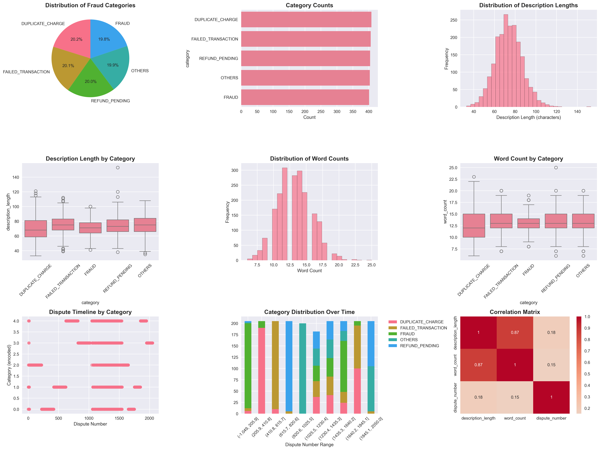

# AI-Powered Dispute Resolution Assistant


This project is a full-stack web application designed to help financial institutions manage and resolve customer payment disputes more efficiently. It combines a machine learning backend for intelligent dispute classification with a modern, interactive frontend built with Next.js and Tailwind CSS.

The application not only categorizes incoming disputes using a sophisticated AI pipeline but also provides tools for analysis, duplicate transaction detection, and a conversational AI agent for natural language queries into the dispute data.

## Project Journey & ML Pipeline

This project was built from the ground up, evolving from a standalone machine learning script into a full-featured web application. The core of the application is a sophisticated AI pipeline designed to understand and categorize dispute descriptions.

### Data Analysis & Visualization Journey

The development process included comprehensive exploratory data analysis to understand the dispute patterns and characteristics:




These visualizations revealed key insights about dispute categories, text patterns, and data distributions that informed the machine learning model design and feature engineering decisions.

### ML Pipeline Development

**1. Data Synthesis & Preparation**: The project began with the creation of a synthetic dataset of over 2,000 dispute descriptions, each manually labeled with one of five categories: `DUPLICATE_CHARGE`, `FAILED_TRANSACTION`, `FRAUD`, `REFUND_PENDING`, or `OTHERS`.

**2. Text Embedding**: To enable a machine learning model to understand the text, we used the powerful `sentence-transformers/all-MiniLM-L6-v2` model from Hugging Face. This model converts each dispute description into a high-dimensional vector (an embedding) that captures its semantic meaning.

**3. Dimensionality Reduction**: The initial embeddings have 384 dimensions, which can be computationally intensive. Principal Component Analysis (PCA) was applied to reduce the dimensionality of these vectors while preserving the most important information, making the model faster and more efficient.

**4. Model Training & Selection**: Several classification models were trained and evaluated on the processed data. A **Logistic Regression** model was ultimately chosen for its excellent balance of performance and interpretability, achieving an accuracy of **84%** on the classification task. The trained model and PCA transformer were serialized into `.pkl` files for use in the application.

**5. AI-Powered Explainability (LLM Integration)**: A simple prediction (`FRAUD`) is not enough for a support agent. To add context and explainability, the pipeline was enhanced with calls to OpenAI's GPT models. For each prediction, an LLM generates:
- A human-readable **Explanation** of why a dispute was placed in a certain category, quoting evidence from the user's text.
- A detailed **Justification** for the suggested next action, providing clear guidance for support agents.

**6. Full-Stack Integration**: The entire pipeline was wrapped in a FastAPI backend, allowing this complex AI logic to be accessed via simple API endpoints and integrated into a user-friendly web interface.

## Features

- **Disputes Dashboard**: A central hub to view all disputes in a clean, filterable table.
- **Detailed Dispute View**: Click on any dispute to see a detailed breakdown, including AI-generated analysis, confidence scores, suggested actions, and a complete history of status changes.
- **Dynamic Status Updates**: Update the status of a dispute in real-time (`OPEN`, `IN_REVIEW`, `RESOLVED`, `CLOSED`) directly from the user interface.
- **Analytics & Trends**: A dedicated analytics page with visualizations showing the daily trends of disputes categorized by type, helping to identify patterns and emerging issues.
- **Fuzzy Duplicate Detection**: An internal tool that scans raw transaction logs to find potential duplicate transactions based on customer ID, amount, merchant, and a short time window.
- **Conversational AI Agent**: A powerful chat interface, powered by LangChain, that allows users to ask questions about the dispute data in natural language (e.g., "How many fraud cases are there?", "List unresolved duplicate charges").

## Tech Stack

### Backend
- **Framework**: FastAPI
- **Database**: SQLite
- **ML/AI**:
    - **Scikit-learn**: For the core Logistic Regression classification model.
    - **LangChain**: To power the conversational AI agent.
    - **OpenAI**: For generating explanations, justifications, and powering the agent's LLM.
    - **Sentence-Transformers**: For creating text embeddings.
- **Data Handling**: Pandas

### Frontend
- **Framework**: Next.js (App Router) with TypeScript
- **Styling**: Tailwind CSS
- **UI Components**: Recharts for data visualization.

## Setup and Installation

Follow these steps to get the project running locally.

### 1. Backend Setup

First, navigate into the `backend` directory:
```bash
cd backend
```

Create and activate a Python virtual environment:
```bash
python3 -m venv venv
source venv/bin/activate
```

Install the required dependencies:
```bash
pip install -r requirements.txt
```

Set up your OpenAI API Key:
You need to provide your OpenAI API key as an environment variable.

macOS/Linux:
```bash
export OPENAI_API_KEY="your_openai_api_key_here"
```

Windows (Command Prompt):
```bash
set OPENAI_API_KEY="your_openai_api_key_here"
```

Set up and populate the database:
This script creates the `database.db` file, sets up the tables, and runs the full AI pipeline to populate it with the initial data.
```bash
python setup_db.py
```

### 2. Frontend Setup

Navigate into the `frontend` directory from the project root:
```bash
cd frontend
```

Install the required npm packages:
```bash
npm install
```

### 3. Generating CSV Files for Submission

The primary application uses a live database. To generate the static `classified_disputes.csv` and `resolutions.csv` files required for the submission, a special export script is provided.

From the `backend` directory (with your venv active), run:
```bash
python export_data.py
```

This will create/update the two CSV files in the main project root directory.

## Running the Application

**⚠️ IMPORTANT: You must run the application to experience its full capabilities and see the AI-powered features in action!**

The static images above only show a glimpse of what this application can do. To truly appreciate the intelligent dispute classification, real-time status updates, conversational AI agent, and interactive analytics, you need to run both servers and interact with the live application.

You need to have both the backend and frontend servers running simultaneously.

**1. Start the Backend Server:**
In your terminal, from the `backend` directory (with the virtual environment active and API key set), run:
```bash
uvicorn app:app --reload
```
The backend API will be available at http://127.0.0.1:8000.

**2. Start the Frontend Server:**
In a separate terminal, from the `frontend` directory, run:
```bash
npm run dev
```
The frontend application will be available at http://localhost:3000.


## How to Use the Application

- **Dashboard**: Open your browser to `http://localhost:3000`. You will see the main dashboard listing all the disputes.
- **View Details**: Click the "View" button on any dispute to navigate to its detailed page. Here you can review the AI's analysis and the case history.
- **Update Status**: On the detail page, use the dropdown menu to change a dispute's status and click "Update". The page will refresh to show the new status and log the change in the history.
- **Analyze Trends**: From the dashboard, click the "View Trends" button to see a bar chart of dispute categories over time.
- **Find Duplicates**: Click the "Tools" button from the dashboard. On this page, click "Scan for Duplicates" to run the fuzzy matching algorithm.
- **Chat with the AI Agent**: Click the "Chat Agent" button. This will open a chat interface where you can ask questions like:
  - “How many duplicate charges today?”
  - “List unresolved fraud disputes”
  - “Break down disputes by type”
# AI-Powered-Dispute-Assistant
